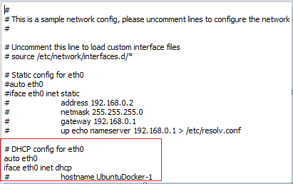
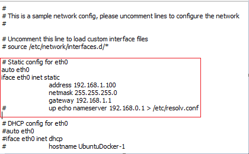
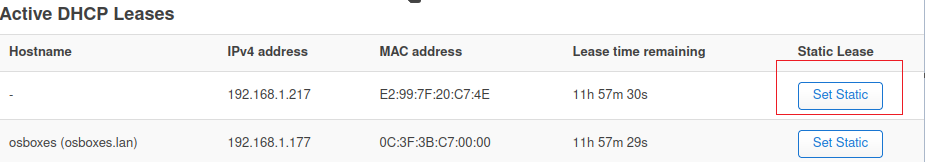
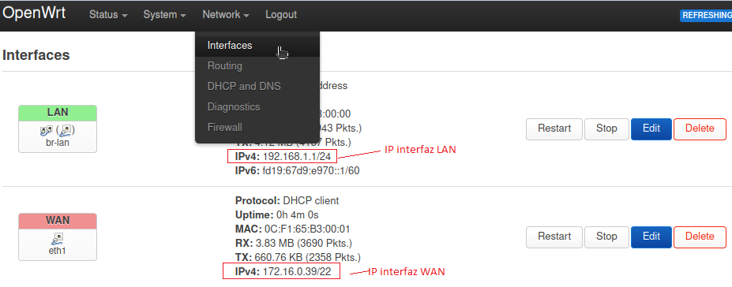
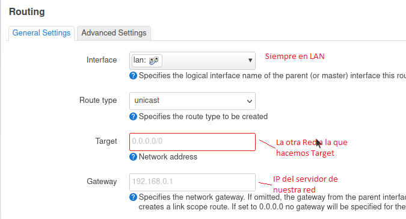
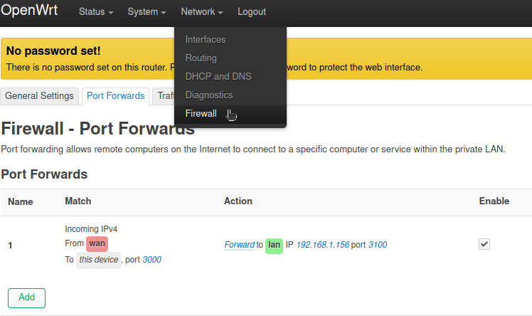
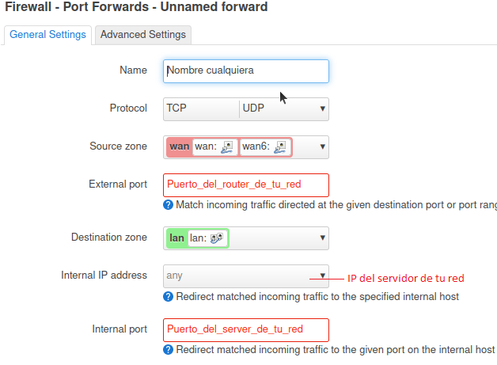

# VPN - GNS3

## Edit config servidores

Descomentar apartados dependiendo de si pide Static o DHCP.

### DHCP



### Static


En la VPN en el archivo `/etc/resolv.conf` insertar si no te hace update o install:
```bash
nameserver 8.8.8.8
```


## Conectarse a los routers

Firefox -> 192.168.1.1

ip servidor -> Set Static (Si se hace por DHCP)  



- configuracion:
  Interface (ver ip router internet)    
  

  Routing (Target: desde donde llegan las peticiones, Gateway: IP servidor)    
 ](img/5.png)

  Firewall (Configurar puertos y seleccionar ip server)  


## Dockers

- Descargar todo lo necesario en ambos dockers

```
apt update -y && apt install wireguard iptables iproute2 -y
```

- nano /etc/sysctl.conf y descomentamos: 
```bash
net.ipv4.ip_forward=1 
```
(sysctl -p para comprobar)
- Generar claves publicas y privadas :

```
  wg genkey > host-a.key
  wg pubkey < host-a.key > host-a.pub
ls
```

- nano /etc/wireguard/wg0.conf

```
[Interface]
Address = 10.0.0.X/32
SaveConfig = true
PreUp = sysctl -w net.ipv4.ip_forward=1
PostUp = iptables -A FORWARD -i %i -j ACCEPT; iptables -t nat -A POSTROUTING -o eth0 -j MASQUERADE
PostDown = iptables -D FORWARD -i %i -j ACCEPT; iptables -t nat -D POSTROUTING -o eth0 -j MASQUERADE
ListenPort = {PUERTO_PROPIO}
PrivateKey = {PRIVATE_KEY_PROPIA}

[Peer]
PublicKey = {PUBLIC_KEY_EXTERNA}
AllowedIPs = {IP_RED_EXTERNA}/24, {IP_TUNEL}/32
Endpoint = {IP_ROUTER_INTERNET}:{PUERTO}
```

Tras editar:

Crear archivo-> 
```bash
wg-quick up /etc/wireguard/wg0.conf
```

Mostrar archivo -> 
```bash
wg show
```

## Instalación de apache

```bash
apt install apache2
```
Posteriormente nos conectaremos desde un cliente a otro a través de su IP en el navegador al otro cliente donde hemos instalado apache. 